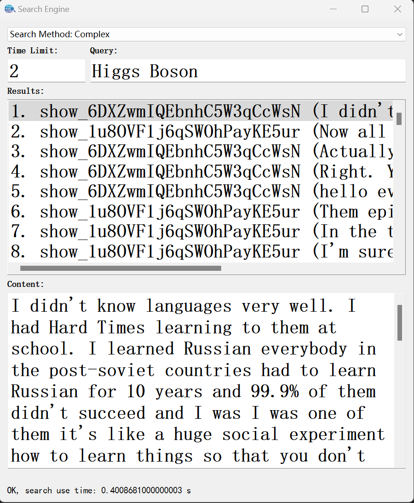

# ElasticSearch_Podcast_Search

### Introduction

This is the group project of DD2477 Search Engines and Information Retrieval Systems (60034) at KTH. We implemented a small search engine which allows user to search for their interested podcast clips based on their query and time constraint. We use the famous [SPOTIFY PODCAST DATASET](https://podcastsdataset.byspotify.com/), which includes the text information of the podcast transcripts and time markers. The main backend framework is [Elasticsearch](https://www.elastic.co/). It's used to index the transcriptions of the podcasts dataset and return ranked search results. The GUI is implemented with PyQt, where users can specify the query and time limit in the text box.

### Members and Contribution

- Minchong Li: Backend logic design
- Tengfei Lu: GUI design
- Zihao Xu: Data indexing and Elasticsearch query design 

### Setup

1. Make sure you have downloaded the SPOFITY PODCAST DATASET, and most importantly, the Elasticsearch engine is installed on your machine.

2. Go to `config.yaml`: modify the `meta_path` and `trans_root` values to your own path for the dataset. 

3. Launch Elasticsearch by running `elasticsearch.bat`.

4. Run `index.bat` if you have not indexed the dataset.

5. Run `search.bat` to start the search engine.

### Usage

1. Input the query and time limit in the corresponding text box.

2. Select search method.

3. Hit the Enter key.

4. Click on an item, and the transcript text will be displayed in the text box at the bottom.
